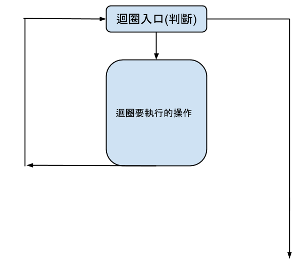

% 控制結構
% Mudream
% March 15, 2015

# Control flow

# Problem

## Classify Score

```
100 >= score >= 90  --> A
90 > score >= 80    --> B
80 > score >= 70    --> C
70 > score >= 60    --> D
60 > score          --> F
```

## Code(I)

```cpp
if(100 >= score and score >= 90)
    puts("A");
else if(90 > score and score >= 80)
    puts("B");
else if(80 > score and score >= 70)
    puts("C");
else if(70 > score and score >= 60)
    puts("D");
else
    puts("F");
```

## Code(II)

```cpp
// assume 100 >= score
if(score >= 90)
    puts("A");
else if(score >= 80)
    puts("B");
else if(score >= 70)
    puts("C");
else if(score >= 60)
    puts("D");
else
    puts("F");
```

## Duplicate

# Switch Case

## Syntax

```cpp
switch(變數){
case 常數1:
    //code...
    break;
case 常數2:
    //code...
    break;
default: //其他情況
    //code..
}
```

## Use?

```cpp
switch(score/10){
case 10:
    puts("A"); break;
case 9:
    puts("A"); break;
case 8:
    puts("B"); break;
case 7:
    puts("C"); break;
case 6:
    puts("D"); break;
default:
    puts("F"); break;
}
```

## Some Problem

### Simplify？

```cpp
case 10:
    puts("A"); break;
case 9:
    puts("A"); break;
```

### Why we need `break`?

## `break` in switch

* break 代表跳出這個結構

```
switch(value){
case 1:
    //...
    break;/--v
case 2:  //  |
 //..        |
 //..        |
default://   |
}//..        |
//-----------<
```

##

* 有`break`就會跳出結構
* 反過來說就是沒有`break`會繼續走下一行

##

```cpp
case 10:
case 9:
    puts("A");
```

# While

## Review


## Problem

多筆資料輸入：

```
不斷的把一個數字讀進來，直到讀不到數字
```

## For-loop solution

```cpp
int val;
for(int t = cin >> val; // Initialize
    t;                  // Condition
    t = cin >> val;  // Iteration){
//...
}
```

## Duplicate code

```cpp
t = cin >> val;
```

## Simple way



## Syntax

```cpp
while(條件){
}
```

## Use

```cpp
int val;
while(cin >> val){
//...
}
```

## Do-while

另一種迴圈

```cpp
do{
}while(Condition);
```

## Do-while

* `while` 在先判斷再跑
* `do-while` 先跑再判斷

## Other

實作無限迴圈？

```cpp
for(;;){
}
```

```cpp
while(true){
}
```

```cpp
do{
}while(true);
```

# Conclusion

## Switch Case

```cpp
switch(Value){
case constant1:
    //...
    break;
case constant2:
    //...
    break;
default:
    //...
}
```

## While

```cpp
while(Condition){
}
```

```cpp
do{
}while(Condition);
```

* 差別：
    * `while` : 先判斷再跑
    * `do-while` : 先跑再判斷

# Pratice On OJ 

## 3n+1 Problem

對一個數字n進行以下操作：

* 假如n是偶數，那就n/2
* 假如n是奇數，那就3n+1

問對於任意正整數，是否可以操作到1

EX:

* 4 -> 2 -> 1
* 5 -> 16 -> 8 -> 4 -> 2 -> 1
